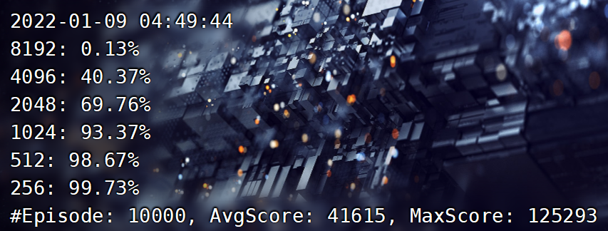

# TD learning for the 2048 Game	


## 代码结构		
复现了网上找到的使用 TD learning 和 n-tuple network 的代码。代码结构如下：

main.py 是主程序，用于接收用户指令。

board.py 包含和游戏盘面相关的操作。

tuplenet.py 包含了与 n-tuple network 维护、TD learning 决策和游戏结果统计相关的操作。

trainer.py 是训练模型的部分。

tester.py 是新增的测试模型并统计结果的部分。

constants.py 和 gamegrid.py 是用于展示游戏界面的程序，用于用户玩游戏或者模型演示。

tupleNet 文件夹下包含了 n-tuple network 各状态的参数。

除了 constants.py 和 gamegrid.py 基本使用原有代码外，其余部分均为复现实现，并且修改了分数的计算规则以适应项目要求，新增了测试与统计模块用于输出项目结果。


## 运行程序


### 人工操作 / 模型演示

>	```
>	python3 main.py --mode=play
>	```

​		w/a/s/d 控制移动方向，h 键让模型帮助移动一步，z 键进入/退出模型自动演示模式。 

​		默认模式为 play ，--mode=play 可以省略。


### 训练模型

>	python3 main.py --mode=train -e=10000 -m=500

​		用于训练模型，参数保存在 tupleNet 文件夹下。

​		会从已保存的模型开始继续训练。如果想要重新训练，需要先删除 tupleNet 下的所有文件。

​		e (episode) 为训练的 episode 数量，默认为 5000 。

​		m (milestone) 为保存模型和统计训练结果的 episode 间隔，默认为 500。

​		每 m 个 episode 后，会输出**这 m 个** episode 的平均得分和各个数字块的合成概率。


### 测试模型

>	python3 main.py --mode=test -e=10000 -m=500

​		用于测试保存在 tupleNet 文件夹下的模型。

​		e (episode) 为测试的 episode 数量，默认为 5000 。

​		m (milestone) 为统计测试结果的 episode 间隔，默认为 500。

​		每 m 个 episode 后，会输出**此前所有** episode 的平均得分和各个数字块的合成概率。


## 结果统计

由于时间限制，只训练了 50000 个 episode，并测试了 10000 个 episode，结果如下。

| Avg Score | Max Score | 8192  | 4096   | 2048   | 1024   | 512    | 256    |
| --------- | --------- | ----- | ------ | ------ | ------ | ------ | ------ |
| 41615     | 125293    | 0.13% | 40.37% | 69.76% | 93.37% | 98.67% | 99.73% |



